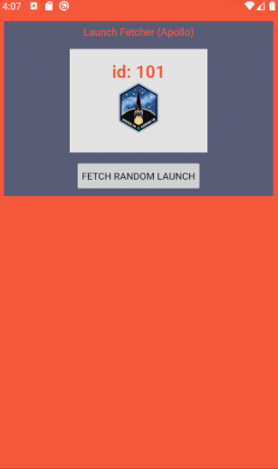

# Clean Modules Apollo Sample

Sample exists to answer this question: can we structure a GraphQL driven app such that:

- it has 3 distinct modules: ui, domain, data
- the domain module does not depend on the data module
- without using the Interface / Implementation pattern for the repositories

(this doesn't get into UseCases, observable stream architectures, or into the view layer with ViewModels, Presenters etc)

# interesting things in this implementation

- the "app" module is there so we can use DI (it needs to see all modules)
- all modules (apart from domain) have the same list of dependencies specified in one place
- the "app" module has all the tests (because it can see all the other modules)

## License

    Copyright 2015-2021 early.co

    Licensed under the Apache License, Version 2.0 (the "License");
    you may not use this file except in compliance with the License.
    You may obtain a copy of the License at

       http://www.apache.org/licenses/LICENSE-2.0

    Unless required by applicable law or agreed to in writing, software
    distributed under the License is distributed on an "AS IS" BASIS,
    WITHOUT WARRANTIES OR CONDITIONS OF ANY KIND, either express or implied.
    See the License for the specific language governing permissions and
    limitations under the License.
