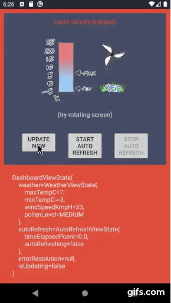

# Strict Unidirectional Data Flow, Clean Architecture Modules, No Reactive Streams




Google's architectural recommendations change slowly over time but at least at the moment (late 2022), this app matches very well with the general principles outlined by google here:

- [separation of concerns](https://developer.android.com/topic/architecture#separation-of-concerns)
- [drive UI from data models](https://developer.android.com/topic/architecture#drive-ui-from-model)
- [single source of truth](https://developer.android.com/topic/architecture#single-source-of-truth)
- [unidirectional data flow](https://developer.android.com/topic/architecture#unidirectional-data-flow)

## 1 Separation of Concerns

From Google: _"It's a common mistake to write all your code in an Activity or a Fragment. These UI-based classes should only contain logic that handles UI and operating system interactions. By keeping these classes as lean as possible, you can avoid many problems related to the component lifecycle, and improve the testability of these classes."_ This could have been taken right out of the [fore](https://erdo.github.io/android-fore/) docs (fore's strap-line is literally: "thinner android view layers"). This sample, like all the apps that use fore observers to tie their architectural layers together, the UI layer here is about as thin as you can possibly get.

## 2 Drive UI from data models

From Google: _"Another important principle is that you should drive your UI from data models, preferably persistent models. Data models represent the data of an app. They're independent from the UI elements and other components in your app. This means that they are not tied to the UI and app component lifecycle, but will still be destroyed when the OS decides to remove the app's process from memory."_ This is how all of the sample fore apps over the last 5 years have been built (observing these models is a fundamental part of implementing reactive UIs with fore). The typical structure is discussed [here](https://erdo.github.io/android-fore/00-architecture.html#shoom), but for this sample specifically the models are: WeatherModel (which is persistent) and RefreshModel (which has only transitory data and is not persistent), these models exist in the domain layer and therefore have no visibility of the UI layer.

## 3 Single Source of Truth

From Google: _"...The SSOT is the owner of [the] data, and only the SSOT can modify or mutate it. To achieve this, the SSOT exposes the data using an immutable type, and to modify the data, the SSOT exposes functions or receive events that other types can call."_ This describes exactly the purpose of the models mentioned above. For example WeatherModel exposes it's data using an immutable WeatherState class, like this: weatherModel.currentState() the state is guaranteed to be the latest correct state as viewed from the UI thread. The only way to modify the weather data is by calling public functions such as: WeatherModel.fetchLatestWeather()

## 4 Unidirectional Data Flow

From Google: _"In UDF, state flows in only one direction. The events that modify the data flow in the opposite direction."_ This is naturally how most fore apps are written (with fore, the state of the models is always what drives the UI, and the most obvious route for the click listeners which mutate that state, is in the opposite direction: from the UI to the models). This is the first sample I'm aware of that formalizes that rule though. So for this sample, rather than have a number of public functions like WeatherModel.fetchLatestWeather() as mentioned above, we instead have a single WeatherModel.send(action: WeatherAction) function, to which we send Actions such as WeatherAction.FetchWeather

## Clean Architecture

The rest of Google's architecture [advice](https://developer.android.com/topic/architecture) on that page is pretty sound (unlike some of their [sample apps](https://dev.to/erdo/tutorial-android-architecture-blueprints-full-todo-app-mvo-edition-259o) 🧐). There is one difference worth highlighting though, in this sample app we have identically named architectural layers to those mentioned in the google docs. But google's domain layer has a dependency on (can see) the data layer. The data layer is typically were your 3rd party libraries are (e.g retrofit) and we would ideally like to be able to swap these out when we want (e.g. to replace retrofit with ktor) without having to re-write our domain layer. If the domain layer is able to "see" retrofit specific code, it's likely that the domain layer will get polluted with various retrofit specific imports, which will mean removing retrofit will indeed mean re-writing the domain layer as well as the data layer, and if you're really unlucky it will mean rewriting the UI layer too.


This problem is why [clean architecture](https://blog.cleancoder.com/uncle-bob/2012/08/13/the-clean-architecture.html) has the dependency arrow pointing the other way. It makes it much harder to accidentally pollute the domain layer with 3rd party data dependencies, and gives us more flexibility to swap those libraries out as we choose. So in our app the data layer can see the domain layer, but the domain layer cannot see the data layer.


# App template
In case you want to use this app as a starting point for something else, there is a bash script included that will rename the app packages (it's written for mac, use at your own risk).

```
git clone git@github.com:erdo/clean-modules-sample.git
cd clean-modules-sample
chmod u+x change_package.sh
./change_package.sh -p com.mydomain.myapp
```
Then open the app as usual in AS. You'll have to change the readme & the app icon yourself. And logcat can be filtered with: myapp_ (if you don't run the change_package script, logcat can be filtered with: clean_)

This repo is also setup as a **github template repository** so you might want to run the script after selecting "Use this template" on the github UI first (of course you'll have to change "erdo/clean-modules-sample" to whatever you called your new repo).

If you want to submit a PR though, you'll need to fork the repo, not template it.

# Testing
I haven't added any unit tests or integration tests, but they would be the same as the tests for all the other samples I've written - the way the app is driven by the models, it's the models that are the main focus for tests (and given that they are written in a pure kotlin model with no knowledge of android, they are easily junit testable). The UI layer is very thin so there isn't a huge amount to test there but you can of course, just by mocking the state exposed by models.

# License

    Copyright 2015-2022 early.co

    Licensed under the Apache License, Version 2.0 (the "License");
    you may not use this file except in compliance with the License.
    You may obtain a copy of the License at

       http://www.apache.org/licenses/LICENSE-2.0

    Unless required by applicable law or agreed to in writing, software
    distributed under the License is distributed on an "AS IS" BASIS,
    WITHOUT WARRANTIES OR CONDITIONS OF ANY KIND, either express or implied.
    See the License for the specific language governing permissions and
    limitations under the License.
