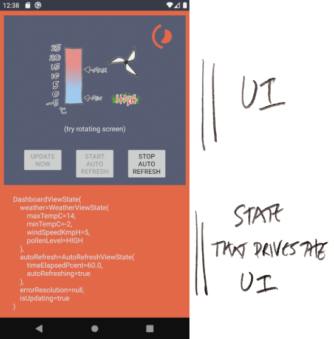

# Clean Architecture (minus Reactive Streams)

There is now a [dev.to](https://dev.to/erdo/clean-architecture-minus-reactive-streams-10i3) post to accompany this repo

Many Android implementations of clean architecture use [Reactive Streams](http://www.reactive-streams.org/) (usually RxJava or Kotlin Flow) to connect architectural layers together. I believe that while Reactive Streams is a fantastic initiative, it is *completely the wrong abstraction* for **architecting android applications** and implementing non-trivial **reactive UIs** (please note, I'm not saying you shouldn't use reactive steams **in Android** there are plenty of good reasons to use reactive streams in general).

The aim of this sample is to showcase an implemention of clean architeture which is: quicker to develop, more robust, easier to understand and maintain, has no magic, has less boilerplate, and a thinner UI layer. These are the qualities that let a technique scale for huge mobile app projects, and if you find any way to improve on the qualities listed, please open an issue or open a PR with suggested improvements.




The typical android clean architecture example you'll find on the internet is only reactive in a fairly trivial way: the UI triggers a request -> then receives a response, sometimes with updates (essentially a callback).

Once you include reacting to things which aren't triggered by the UI though, things get complicated. Let's say you want your UI to react to a change of network status, or an external accessory being plugged in, or a notification being received to the device (or all of these at the same time). Add Android's infamous lifecycle into the mix, and the abstraction starts to look a little shakey.

The typical solution to this is to turn _everything_ into a reactive stream, and with enough RxJava operators you can of course fix all the caching and memory reference problems - but these are problems that _only exist_ because of choosing an inappropriate abstraction in the first place. Remove Reactive Streams from your android architecture and you remove the problems

The UI above is reasonably complex, reactive, supports rotation, handles process death, and of course has no memory leaks. It's a single Activity written in 100 lines of code, and the ViewModel is about 60 lines. A reactive streams implementation is unlikely to match that level of code simplicity, and the situation rapidly deteriorates as you add more things to react to, like network availability, notifications etc.

You can read more about how to tie architectural layers in this way in the [fore docs](https://erdo.github.io/android-fore/00-architecture.html#shoom)

# How does it work

So how do you have reactive UIs without using reactive streams? In a nutshell: the observer pattern. This has been around for maybe half a century(?) and is the basis of just about every low level UI component in existence AFAIK.

In this sample, the observable pattern is implemented with a library (fore) but it's important to realise that the actual code is fairly trivial, it boils down to a list of observers (usually the observers are in the UI layer somewhere) that implement this interface:

```
interface Observer {
    fun somethingChanged()
}
```

## Clean modules

This is how the kotlin modules are arranged in this sample (domain is implemented as a pure kotlin module). The app module is used for DI and that's about it (the app module is the only module that can see all other modules).


All Android implementations of [clean architecture](https://blog.cleancoder.com/uncle-bob/2012/08/13/the-clean-architecture.html) need to be adapted because the original clean architecture blog post leans towards server side considerations, it doesn't directly address mobile applications, or kotlin, or reactive UIs, or ViewModels, or even say much about how you should treat state. As such there are no presenters, controllers or entities in this sample, and we use the word [*model*](https://en.wikipedia.org/wiki/Domain_model) to represent domain model classes, and they collaborate with each other using **mediators**.

## Where are the use cases?
You might be familiar with the common implementations of clean architecture adapted for android apps that are mentioned at the top of these docs - they often use a particular form of stateless UseCase class implemented with reactive streams. If you're interested, the [use cases](https://en.wikipedia.org/wiki/Use_case) for this app can be found in the public functions of the domain models e.g. WeatherModel.fetchWeatherReport()

## Thick domain layer
One aspect of this app's structure I particularly like is that it solves the problem of a thin domain layer. Alternative clean implementations I've used end up with a domain module containing nothing more than Repository interfaces, data classes, and a large number of (usually trivial) UseCase classes. Remember the domain module is typically the only module that is pure kotlin and completely abstracted from android itself, that makes it easy to test and highly portable so we really want keep as much code there as possible - it'll set us up nicely if we want to move to KMP later, for example.


# App template
In case you want to use this app as a starting point for something else, there is a bash script included that will rename the app packages (it's written for mac, use at your own risk).

```
git clone git@github.com:erdo/clean-modules-sample.git
cd clean-modules-sample
chmod u+x change_package.sh
./change_package.sh -p com.mydomain.myapp
```
Then open the app as usual in AS. You'll have to change the readme & the app icon yourself. And logcat can be filtered with: myapp_ (if you don't run the change_package script, logcat can be filtered with: clean_)

This repo is also setup as a **github template repository** so you might want to run the script after selecting "Use this template" on the github UI first (of course you'll have to change "erdo/clean-modules-sample" to whatever you called your new repo).

If you want to submit a PR though, you'll need to fork the repo, not template it.

# Testing
I haven't added any unit tests or integration tests. I might get around to it, but they would be the same as the tests for all the other samples I've written. If I do I will add them all to the **app** module (I've found that adding tests to the individual modules spreads the tests around for no particular reason and causes problems any time you have a common test class that you want to reuse - most of the modules can only see one or no other modules so they can't share test code and you end up either duplicating shared test code or adding a common test module - which might as well be the app module :/ )

# Next steps
I'm working on a commercial sample at the moment which is a lot bigger and uses GraphQL, Ktor and Retrofit in the same app, it has exactly the same structure as this code, but there is so much of it, it's not really suitable as a "clean architecture without reactive streams" primer. It'll probably drop in a month or so, when it does I'll add it to the android-fore [project summary](https://github.com/erdo?tab=projects).

# License

    Copyright 2015-2021 early.co

    Licensed under the Apache License, Version 2.0 (the "License");
    you may not use this file except in compliance with the License.
    You may obtain a copy of the License at

       http://www.apache.org/licenses/LICENSE-2.0

    Unless required by applicable law or agreed to in writing, software
    distributed under the License is distributed on an "AS IS" BASIS,
    WITHOUT WARRANTIES OR CONDITIONS OF ANY KIND, either express or implied.
    See the License for the specific language governing permissions and
    limitations under the License.
